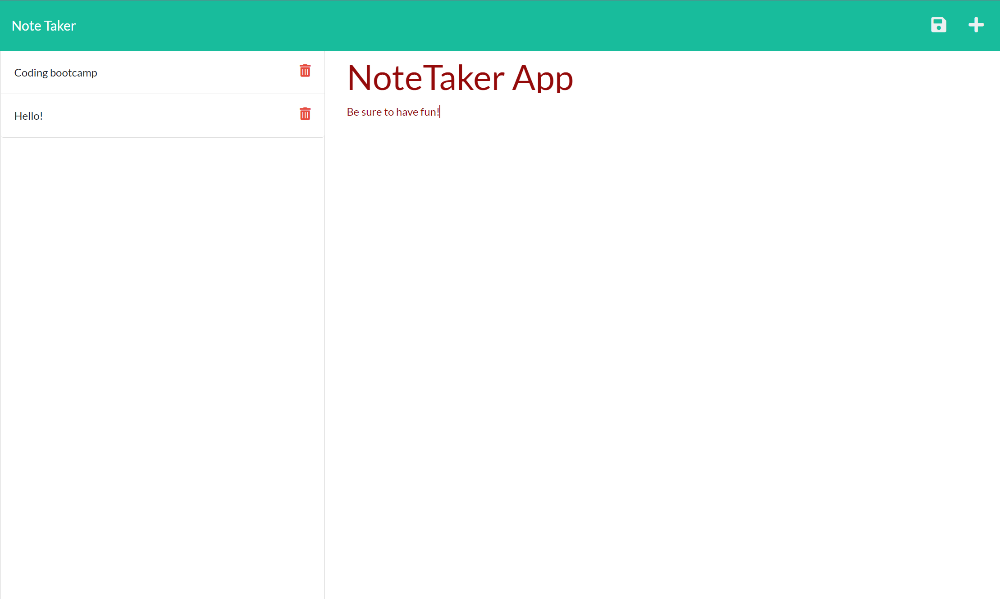
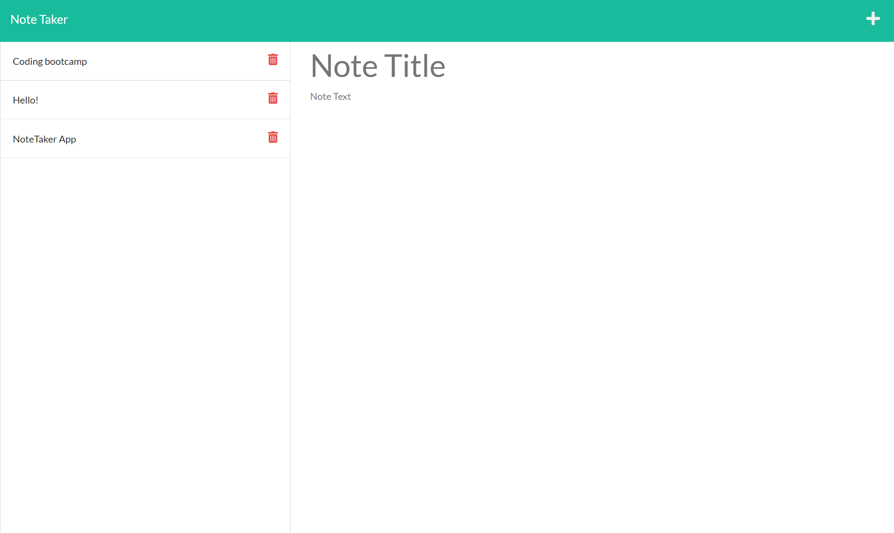

# NoteTaker
This application is designed to take notes and give the user a custom option to give their notes a title. This site also stores the list of notes you have created to the left forming a column of your saved notes. If users want to delete a note, they also have the option to delete a note by pressing the trash icon in their selected note. 


## Getting Started
Copy down the live link from github. Once you have, you can open up a terminal within VS Code and then  run a NPM install command. Once the installation is complete, you can then type in "node server.js" which will generate a localhost link where you can follow and the link opens the notetakerapp in your local browser. If you go back to the terminal after deleting an item off your list, the terminal should respond back with a "recieved delete request" notifying the user your note has been successfully deleted.


### Prerequisites

-Install Heroku

-Install Node

-Install VS Studio Code


### Installing

NPM install in integrated terminal

```

Then run the following command: npm start

```

Click on the link that is created and there you go!

## Screenshot of site






## Built With

* [HTML](https://developer.mozilla.org/en-US/docs/Web/HTML)
* [CSS](https://developer.mozilla.org/en-US/docs/Web/CSS)
* [Javascript](https://developer.mozilla.org/en-US/docs/Web/JavaScript)

## Deployed Link

* [See Live Site](https://georgenotetakerapp.herokuapp.com/)


## Authors

* **George Sandoval** 

- [Link to Portfolio Site](https://gsandoval09.github.io/UpdatedProfessionalPortfolio/)
- [Link to Github](https://github.com/gsandoval09)
- [Link to LinkedIn](www.linkedin.com/in/george-sandoval-4467641b3)


## License

This project is licensed under the MIT License 

## Acknowledgments

* Google
* w3schools
* Mozilla
